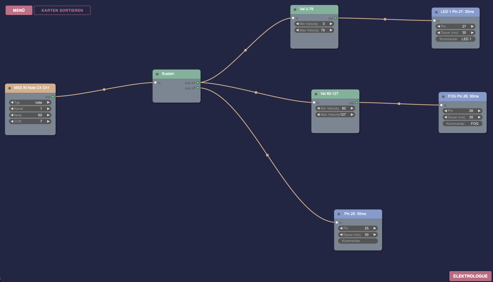

# Pico MIDI Mapper

**A flexible, JSON-configurable MIDI-to-GPIO controller for Raspberry Pi Pico**

[](https://opensource.org/licenses/MIT)
[](https://github.com/schnell-auswahl/pico-midi-mapper/releases/latest)
[](https://platformio.org/)
[](https://www.raspberrypi.com/products/raspberry-pi-pico/)

Transform your Raspberry Pi Pico into a universal MIDI-controlled I/O interface. Control solenoids, LEDs, motors, relays, or any GPIO-compatible device using MIDI messages - **all configured visually in your browser, no coding required!**

---

## 🎨 Web-Based Visual Configuration

**Create your MIDI mappings with the drag-and-drop editor** - the recommended way to configure your Pico MIDI Mapper:

<div align="center">

### **[🌐 Open MIDI Mapper Editor →](https://elektrologue.com/midi-mapper-editor.html)**

[](https://elektrologue.com/midi-mapper-editor.html)

[](https://elektrologue.com/midi-mapper-editor.html)

*Visual node-based editor - design your MIDI-to-GPIO mappings in minutes, no coding required!*

**Why use the web editor?**
- ✅ **Visual workflow** - see your signal routing in real-time
- ✅ **Validation** - catch configuration errors before uploading
- ✅ **No coding** - just drag, connect, and configure
- ✅ **Built-in docs** - tooltips for every setting
- ✅ **Export ready** - downloads perfect `config.json` files

</div>

---

## 🚀 Quick Installation (3 Steps, No Coding!)

**Get started in minutes - no PlatformIO or programming required:**

### 1️⃣ Download Firmware
- Go to **[Latest Release](https://github.com/schnell-auswahl/pico-midi-mapper/releases/latest)**
- Download `pico-midi-mapper-vX.X.X.uf2`

### 2️⃣ Flash Your Pico (One Time)
- **Hold BOOTSEL button** on Pico while connecting USB
- Pico appears as **RPI-RP2** USB drive
- **Drag the `.uf2` file** onto the drive
- Pico automatically reboots - **firmware installed!** ✅

### 3️⃣ Upload Your Config (Anytime)
- Create config in **[Web Editor](https://elektrologue.com/midi-mapper-editor.html)**
- **Hold CONFIG button** (GPIO 22 to GND) while connecting USB
- Pico appears as **PICO FS** USB drive
- **Drag `config.json`** onto the drive
- Disconnect and reconnect - **ready to play!** 🎉

**No recompilation. No command line. No IDE required.**

Perfect for:
- 🎵 Live performance tweaking
- 🔧 Rapid prototyping and testing
- 👥 Non-programmers
- 🎹 Multiple configurations for different shows

---

## ✨ Features

- **🎹 Dual MIDI Input**: USB MIDI + UART MIDI (5-pin DIN) simultaneously
- **� MIDI Through**: Daisy-chain multiple Picos for unlimited I/O expansion
- **📍 Flexible GPIO Mapping**: Map any MIDI note or CC to any GPIO pin
- **⚡ Multiple Action Types**:
  - **Pulse** - Timed trigger (perfect for solenoids)
  - **Toggle** - On/Off switching (LEDs, relays)
  - **PWM** - Analog control via velocity or CC values
- **🎚️ Advanced Filtering**: Velocity ranges, sustain pedal support
- **🌐 Web-Based Editor**: Visual node-based configuration tool
- **💾 Easy Updates**: USB mass storage mode for configuration changes
- **🔧 Up to 50 mappings per Pico**: Scale infinitely with daisy-chaining

---

## 🎯 Use Cases

<table>
<tr>
<td width="33%">

### 🎺 Solenoid Instruments
Build MIDI-controlled acoustic instruments like glockenspiels, chimes, or percussion robots

</td>
<td width="33%">

### 💡 LED Control
Drive LED strips, matrices, or individual LEDs with velocity-sensitive brightness

</td>
<td width="33%">

### 🔌 Automation
Control relays, motors, pneumatic valves, or other actuators via MIDI

</td>
</tr>
</table>

---

## 🚀 Quick Start (Step-by-Step)

### Step 1: Download Firmware

**Get the latest pre-compiled firmware:**

1. Go to **[GitHub Releases](https://github.com/schnell-auswahl/pico-midi-mapper/releases/latest)**
2. Download `pico-midi-mapper-vX.X.X.uf2` (typically 200-500 KB)
3. Save to your computer

### Step 2: Flash Firmware to Pico

**Using BOOTSEL mode (works on all computers, no drivers needed):**

1. **Disconnect** your Pico from USB
2. **Hold down the BOOTSEL button** on your Pico
3. **While holding BOOTSEL**, connect USB cable to computer
4. **Release BOOTSEL** - Pico appears as **RPI-RP2** USB drive
5. **Drag and drop** the `.uf2` file onto the RPI-RP2 drive
6. **Pico automatically reboots** and starts running the firmware ✅

**Note:** You only need to flash firmware once. Config updates use a different method (see Step 4).

[→ Detailed installation guide](docs/INSTALLATION.md) | [→ Troubleshooting](docs/INSTALLATION.md#troubleshooting)

### Step 3: Create Your MIDI Mappings

**Use the visual web editor** (recommended):

1. Open **[MIDI Mapper Editor](https://elektrologue.com/midi-mapper-editor.html)** in your browser
2. **Add nodes:**
   - MIDI inputs (Note or Control Change)
   - GPIO outputs (Pulse, Toggle, or PWM)
3. **Connect** nodes by dragging between ports
4. **Configure** each node (pin numbers, durations, velocity ranges)
5. **Export** → Download your `config.json` file

**Alternative:** Manually write JSON - see [Configuration Format](docs/CONFIGURATION_FORMAT.md)

### Step 4: Upload Configuration to Pico

**Using USB Mass Storage mode (no re-flashing needed!):**

1. **Disconnect** your Pico from USB
2. **Connect GPIO 22 to GND** (or press CONFIG button if you installed one)
   ```
   GPIO 22 ──┤ ├── GND    (or use a button)
   ```
3. **While GPIO 22 is grounded**, connect USB cable
4. Pico appears as **PICO FS** USB drive (LED blinks slowly)
5. **Drag your `config.json`** onto the PICO FS drive
6. **Eject safely** and disconnect USB
7. **Reconnect normally** (without GPIO 22 grounded)
8. **Your mappings are now active!** 🎉

**Alternative (no GPIO access):** Send MIDI SysEx command `F0 7D 47 43 01 F7` to enter config mode

[→ USB Mass Storage details](docs/USB_MASS_STORAGE.md)

### Step 5: Connect MIDI & Test!

**Connect your MIDI source:**
- **USB MIDI**: Plug MIDI controller or DAW into Pico's USB port
- **Hardware MIDI**: Connect 5-pin DIN to GPIO 1 (RX) - [see wiring](docs/HARDWARE_SETUP.md)

**Test your mappings:**
- Play notes or send CC messages from your MIDI controller
- GPIO pins should trigger according to your config
- Onboard LED (GPIO 25) can be used for testing without external hardware

**You're ready to go!** 🎹

---

## 👨‍💻 Advanced: Build from Source

**For developers who want to modify the firmware:**

```bash
# Install PlatformIO first (if not already installed)
# https://platformio.org/install

# Clone this repository
git clone https://github.com/schnell-auswahl/pico-midi-mapper.git
cd pico-midi-mapper

# Build firmware
pio run

# Flash to Pico (via BOOTSEL or picotool)
pio run --target upload
```

**Build your own release:**
```bash
pio run
cp .pio/build/pico/firmware.uf2 my-custom-firmware.uf2
```

[→ See BUILD_RELEASE.md](BUILD_RELEASE.md) for creating GitHub releases

---

## 📖 Example: Solenoid Glockenspiel

```json
{
  "version": 1,
  "maps": [
    {
      "t": "n",       // Type: Note
      "ch": 1,        // MIDI Channel 1
      "n": 60,        // Note 60 (Middle C)
      "p": 2,         // GPIO Pin 2
      "a": "p",       // Action: Pulse
      "d": 30         // Duration: 30ms
    },
    {
      "t": "n",
      "ch": 1,
      "n": 62,        // Note 62 (D)
      "p": 3,
      "a": "p",
      "d": 30
    }
  ]
}
```

[→ See more examples](examples/)

---

## 🛠️ Hardware Setup

### Minimal Setup (Testing)
- Raspberry Pi Pico
- USB cable
- That's it! Test with the onboard LED (GPIO 25)

### Full Setup (Solenoids/Actuators)
- Raspberry Pi Pico
- N-Channel MOSFETs (logic-level: IRLZ44N, IRL540N)
- Flyback diodes (1N5819 Schottky recommended)
- Gate resistors (220Ω - 1kΩ)
- External power supply (12V for solenoids)
- Optional: MIDI input circuit (6N138 optocoupler)

[→ Detailed wiring guide](docs/WIRING_DETAILS.md) | [→ Bill of materials](docs/BILL_OF_MATERIALS.md)

---

## 📚 Documentation

- **[Installation Guide](docs/INSTALLATION.md)** - First-time setup
- **[Configuration Format](docs/CONFIGURATION_FORMAT.md)** - JSON structure reference
- **[Hardware Setup](docs/HARDWARE_SETUP.md)** - Component selection & assembly
- **[Wiring Details](docs/WIRING_DETAILS.md)** - Circuit diagrams
- **[MIDI Features](docs/MIDI_FEATURES.md)** - Advanced MIDI control
- **[USB Mass Storage](docs/USB_MASS_STORAGE.md)** - Technical details

---

## 🔧 Configuration Reference

### Action Types

| Action | Code | Description | Required Fields |
|--------|------|-------------|----------------|
| **Pulse** | `"p"` | Brief trigger (e.g., solenoid strike) | `d` (duration) |
| **Toggle** | `"t"` | On/Off state (LED, relay) | - |
| **PWM** | `"w"` | Analog control (brightness, speed) | `pm` (PWM mode) |

### PWM Modes

| Mode | Code | Description |
|------|------|-------------|
| **Velocity** | `"v"` | Use MIDI velocity (0-127) as PWM value |
| **CC Value** | `"c"` | Use Control Change value for PWM |
| **Fixed** | `"f"` | Fixed PWM value with timed pulse |

[→ Complete configuration reference](docs/CONFIGURATION_FORMAT.md)

---

## � Scale Up: Daisy-Chain Multiple Picos

**Need more than 50 mappings?** Chain multiple Picos together using MIDI Through!

### How It Works

Each Pico can forward incoming MIDI to the next unit via its TX pin, creating an unlimited expansion system:

```
MIDI Source → Pico 1 (50 mappings) → Pico 2 (50 mappings) → Pico 3 (50 mappings) → ...
              ├─ GPIO 2-26           ├─ GPIO 2-26           ├─ GPIO 2-26
              └─ Up to 24 outputs    └─ Up to 24 outputs    └─ Up to 24 outputs
```

**Capabilities:**
- ✅ **Unlimited expansion** - add as many Picos as needed
- ✅ **Same MIDI source** - all units receive identical messages
- ✅ **Independent configs** - each Pico can map different notes/CCs
- ✅ **Low latency** - <1ms propagation delay per unit
- ✅ **Powered via USB** - each Pico connects to USB hub or individual power

### Wiring: MIDI Through Connection

**Simple 3-wire connection between Picos:**

```
Pico 1 (Primary)              Pico 2 (Secondary)
┌─────────────┐               ┌─────────────┐
│             │               │             │
│ GP0 (TX) ○──┼───────────────┼──○ GP1 (RX) │
│             │               │             │
│ GND ●───────┼───────────────┼───● GND     │
│             │               │             │
└─────────────┘               └─────────────┘
```

**Pin connections:**
- **Pico 1 GP0 (TX)** → **Pico 2 GP1 (RX)**
- **Common GND** between all Picos
- Optional: **Pico 1 VBUS** → **Pico 2 VSYS** (daisy-chain power, max 2-3 units)

**For longer chains:**
```
MIDI In → [Pico 1] → [Pico 2] → [Pico 3] → [Pico N]
           GP0  →    GP1  GP0 → GP1  GP0 → GP1
           
All GND pins connected together
Each Pico powered individually via USB
```

### Example: 150-Output System

**3 Picos daisy-chained:**

| Pico | MIDI Channel | Notes/CCs | Outputs | Use Case |
|------|--------------|-----------|---------|----------|
| **Pico 1** | Channel 1 | Notes 60-79 (20 mappings) | GP2-21 | Solenoid glockenspiel |
| **Pico 2** | Channel 2 | CC 1-24 (24 mappings) | GP2-25 | LED matrix brightness |
| **Pico 3** | Channel 3 | Notes 36-43 (8 mappings) | GP2-9 | Relay-controlled motors |

**Total: 52 independent mappings across 52 GPIO outputs!**

### Configuration Tips for Daisy-Chaining

1. **Use different MIDI channels** - easier to manage which Pico responds
2. **Or use non-overlapping notes/CCs** - all on same channel, different ranges
3. **Label each Pico** - physical labels prevent confusion
4. **Keep configs backed up** - name them `pico1.json`, `pico2.json`, etc.
5. **Test individually first** - verify each Pico before chaining

### Wiring Best Practices

- **Keep TX/RX wires short** (<50cm for reliable signal)
- **Use twisted pair** for TX/RX if longer runs needed
- **Individual USB power** recommended for 4+ Picos
- **Common ground essential** - all GND pins must connect
- **Star topology possible** - use MIDI splitter box for parallel instead of serial

---

## �💡 Example Projects

### 🎼 Solenoid Glockenspiel
19-note electro-acoustic instrument
- [Configuration](examples/solenoid-glockenspiel/)
- MIDI channel 1, notes 60-78
- 30ms pulse duration

### 💡 LED Matrix
RGB LED control with velocity
- [Configuration](examples/led-control/)
- PWM brightness via velocity
- Multi-channel support

### 🔌 Relay Board
8-channel home automation
- [Configuration](examples/relay-board/)
- Toggle mode for relays
- Sustain pedal support

---

## 🤝 Contributing

Contributions are welcome! Please feel free to submit a Pull Request.

---

## 📄 License

This project is licensed under the MIT License - see the [LICENSE](LICENSE) file for details.

---

## 🙏 Acknowledgments

- Built with [PlatformIO](https://platformio.org/)
- Uses [Adafruit TinyUSB Library](https://github.com/adafruit/Adafruit_TinyUSB_Arduino)
- Uses [Arduino MIDI Library](https://github.com/FortySevenEffects/arduino_midi_library)
- Inspired by the maker and MIDI hacking community

---

## 🔗 Links

- **Web Configuration Tool**: [elektrologue.com/midi-mapper-editor.html](https://elektrologue.com/midi-mapper-editor.html)
- **Report Issues**: [GitHub Issues](https://github.com/schnell-auswahl/pico-midi-mapper/issues)
- **Raspberry Pi Pico**: [Official Documentation](https://www.raspberrypi.com/documentation/microcontrollers/raspberry-pi-pico.html)

---

**Made with ❤️ for the MIDI and maker community**
